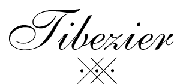
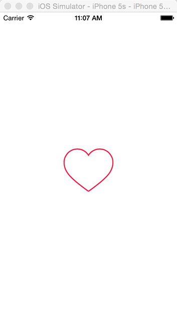
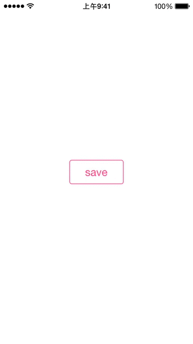

An iOS UIBezierPath wrapper for Titanium.

## Installation

Git-cloning the repository, unzip the `guy.mcdooooo.tibezier-iphone-1.0.0.zip` package and put the `modules/iphone/guy.mcdooooo.tibezier` into the `modules/iphone` folder of your project. 

To access this module from JavaScript, you would do the following:

```javascript
var Drawer = require("guy.mcdooooo.tibezier");
```

The `Drawer` variable is a reference to the Module object.


## Drawing a heart

```javascript
var win = Ti.UI.createWindow({
	backgroundColor:'white'
});

var canvas = Drawer.createView({
	width: 88,
	height: 76,
	bezier: {
		lineWidth: 2,
		miterLimit: 4,
		strokeColor: '#FF2D55',
		fillColor: 'transparent',
		paths: [{
			draw: 'moveToPoint',
			point: [64.22, 0]
		}, {
			draw: 'addCurveToPoint',
			endPoint: [48.27, 6.18],
			controlPoint1: [58.33, 0],
			controlPoint2: [52.67, 2.19]
		}, {
			draw: 'addCurveToPoint',
			endPoint: [44, 11.31],
			controlPoint1: [46.6, 7.69],
			controlPoint2: [45.17, 9.41]
		}, {
			draw: 'addCurveToPoint',
			endPoint: [39.73, 6.18],
			controlPoint1: [42.83, 9.41],
			controlPoint2: [41.4, 7.69]
		}, {
			draw: 'addCurveToPoint',
			endPoint: [23.78, 0],
			controlPoint1: [35.33, 2.19],
			controlPoint2: [29.67, 0]
		}, {
			draw: 'addCurveToPoint',
			endPoint: [0, 23.82],
			controlPoint1: [10.67, 0],
			controlPoint2: [0, 10.69]
		}, {
			draw: 'addCurveToPoint',
			endPoint: [9.21, 47.23],
			controlPoint1: [0, 32.69],
			controlPoint2: [2.75, 39.69]
		}, {
			draw: 'addCurveToPoint',
			endPoint: [43.32, 75.62],
			controlPoint1: [18.58, 58.19],
			controlPoint2: [42.31, 74.91]
		}, {
			draw: 'addCurveToPoint',
			endPoint: [44, 75.83],
			controlPoint1: [43.52, 75.76],
			controlPoint2: [43.76, 75.83]
		}, {
			draw: 'addCurveToPoint',
			endPoint: [44.68, 75.62],
			controlPoint1: [44.24, 75.83],
			controlPoint2: [44.48, 75.76]
		}, {
			draw: 'addCurveToPoint',
			endPoint: [78.8, 47.23],
			controlPoint1: [45.69, 74.91],
			controlPoint2: [69.42, 58.19]
		}, {
			draw: 'addCurveToPoint',
			endPoint: [88, 23.82],
			controlPoint1: [85.25, 39.69],
			controlPoint2: [88, 32.69]
		}, {
			draw: 'addCurveToPoint',
			endPoint: [64.22, 0],
			controlPoint1: [88, 10.69],
			controlPoint2: [77.33, 0]
		}, {
			draw: 'closePath'
		}]
	}
});

win.add( canvas );
win.open();
```

which will give you a lovely output:




##Function list
```javascript
var Drawer = require("guy.mcdooooo.tibezier");

Drawer.createView({

	// any properties that decorate
	// the general Ti.UI.View:
	width: 80,
	height: 70,
	...
	
	// Bezier path specific APIs:
	bezier: {
	
		// The line width of the path.
		lineWidth: 2,
		
		// The color used to stroke the shape’s path.
		strokeColor: '#FF2D55',
		
		// The color used to fill the shape’s path.
		fillColor: 'transparent',
		
		// The relative location at which to begin stroking the path.
		strokeStart: 0.0,
		
		// The relative location at which to stop stroking the path
		strokeEnd: 1.0,
		
		// The flatness value measures the largest permissible distance (measured in
		// pixels) between a point on the true curve and a point on the rendered curve.
		// Smaller values result in smoother curves but require more computation time.
	    // Larger values result in more jagged curves but are rendered much faster.
	    // The default flatness value is 0.6.
		flatness: 0.8,		
				
		// The limiting value that helps avoid spikes at junctions between connected
		// line segments.
		miterLimit: 4,
		
		
		// The shape of the paths end points when stroked.
		lineCapStyle: "butt", // A line with a squared-off end. 
							   // Drawing the line to extend only to 
							   // the exact endpoint of the path. 
							   // This is the default.
							   
		lineCapStyle: "round", // A line with a rounded end.
		 
		lineCapStyle: "square", // A line with a squared-off end. 
								 // Extending the line beyond the endpoint 
								 // of the path for a distance equal to half 
								 // the line width.
								 
		// Junction types for stroked lines.	
		lineJoinStyle: 'miter', // A join with a sharp (angled) corner
		
		lineJoinStyle: 'round', // A join with a rounded end.
		
		lineJoinStyle: 'bevel', // A join with a squared-off end.
		
		
		// Draws a line along the path 
		// using the current drawing properties.
		stroke: true (BOOL),
		
		// Paints the region enclosed by the path 
		// using the current drawing properties.
		fill: false (BOOL),
		
		// Intersects the area enclosed by the path with 
		// the clipping path of the current graphics context 
		// and makes the resulting shape the current clipping path.
		addClip: false (BOOL),
		
		// A Boolean indicating whether the even-odd 
		// winding rule is in use for drawing paths.
		usesEvenOddFillRule: true (BOOL), 
		
		// The graphic is described by an array of paths.
		// A path is defined by the drawing method and points
		// in the form of 
		// {
		       draw: 'drawing method'
		       point: []
		// }
		paths: [
		
		// Moves the current point to the specified location.
		{
			draw: 'moveToPoint',
			point: [0.0, 1.0]
		}, 
		
		// Appends a straight line to the path.
		{
			draw: 'addLineToPoint',
			point: [2.0, 3.0],
		}, 
		
		// Appends a cubic Bézier curve to the receiver’s path.
		{
			draw: 'addCurveToPoint',
			endPoint: [4.0, 5.0],
			controlPoint1: [6.0, 7.0],
			controlPoint2: [8.0, 9.0],
		}, 
		
		// Appends a quadratic Bézier curve to the receiver’s path.
		{
			draw: 'addQuadCurveToPoint',
			endPoint: [10.0, 11.0],
			controlPoint1: [12.0, 13.0],
		},
		
		// Appends an arc of a circle to the path.
		{
			draw: 'addArcWithCenter',
			
			center: [14.0, 15.0], // the center point of the circle 
								   // used to define the arc.
								   
			radius: 25, // the radius of the circle used to define the arc.
			
			startAngle: 30, // the starting angle of the arc.
			
			endAngle: 90, // the end angle of the arc.
			
			clockwise: true (BOOL), // The direction in which to draw the arc.
		},
		
		// A rectangular path.
		{
			draw: 'rect',
			rect: [
				0.0, // x point
				0.0, // y point
				100, // width
				200  // height
			]
		},
		
		// An oval path inscribed in the specified rectangle.
		{
			draw: 'oval',
			rect: [
				0.0, // x point
				0.0, // y point
				100, // width
				200  // height
			]
		},
		
		// A rounded rectangular path.
		{
			draw: 'roundedRect',
			rect: [
				0.0, // x point
				0.0, // y point
				100, // width
				200  // height
			],
			borderRadius: 14
		},
		
		// Closes the most recently added subpath.
		{
			draw: 'closePath'
		}
		
		]
	}
});
```

Getting more details about UIBezierPath from [iOS Developer Library](https://developer.apple.com/library/ios/documentation/UIKit/Reference/UIBezierPath_class/index.html#//apple_ref/occ/instm/UIBezierPath/closePath).

## Working together with Tipop
It's easy to anmiate bezier paths with [Tipop](https://github.com/McDo/tipop). Here is an example: 

```javascript
var Drawer = require('guy.mcdooooo.tibezier');
var POP = require('guy.mcdooooo.tipop');

var saved = false;

// open a single window
var win = Ti.UI.createWindow({
	backgroundColor:'white'
});

var buttonWrapper = Ti.UI.createView({
	width: 100,
	height: 100
});

var button = Drawer.createView({
		width: 90,
		height: 40,
		backgroundColor: 'transparent',
		borderRadius: 4,
		borderWidth: 1,
		borderColor: "#FF4981",
		bezier: {
			lineCapStyle: 'round',
			lineJoinStyle: 'round',
			lineWidth: 2,
			miterLimit: 4,
			strokeColor: '#FF4981',
			strokeEnd: 0.0,
			fillColor: 'transparent',
			paths: [{
				draw: 'moveToPoint',
				point: [18.5, 43.53]
			}, {
				draw: 'addLineToPoint',
				point: [29.21, 54.5]
			}, {
				draw: 'addLineToPoint',
				point: [57.5, 25.5]
			}]
		}
});

var label = Ti.UI.createLabel({
	text: "save",
	color: "#FF4981",
	font: {
		fontSize: 18
	}
});

buttonWrapper.add( label );
buttonWrapper.add( button );

button.addEventListener('click', function() {
	if ( !saved ) {
		POP
		.basic(label, {
			scale: {
				x: 0.2,
				y: 0.2
			},
			opacity: 0,
			easing: 'easeInOutQuart',
			duration: 420
		});
		
		setTimeout(function() {
			POP
			.spring(button, {
				width: 75,
				height: 75,
				borderRadius: 37.5,
				springBounciness: 2,
        		springSpeed: 15
			});
		
			POP
			.basic(button, {
				strokeEnd: 1.0,
				easing: 'easeInOutQuart',
				duration: 420,
				delay: 360
			});
		}, 320);
	}  
});

win.add( buttonWrapper );
win.open();

```


## Author

- [@McDo](https://github.com/McDo)

- email: [mcdooooo@gmail.com](mailTo:mcdooooo@gmail.com)

- twitter: [do109](https://twitter.com/do109)
